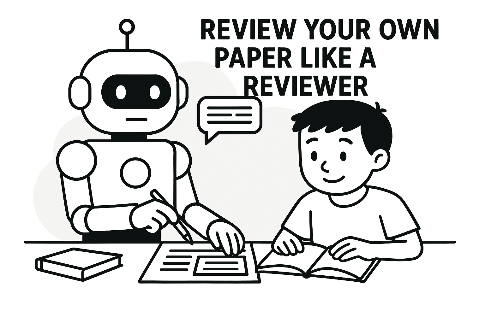
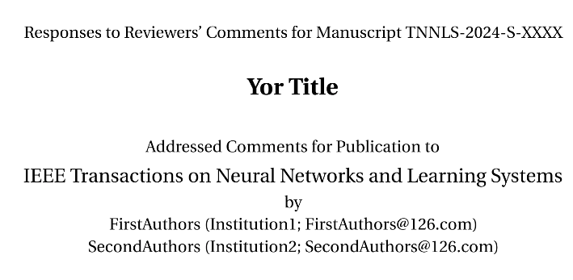
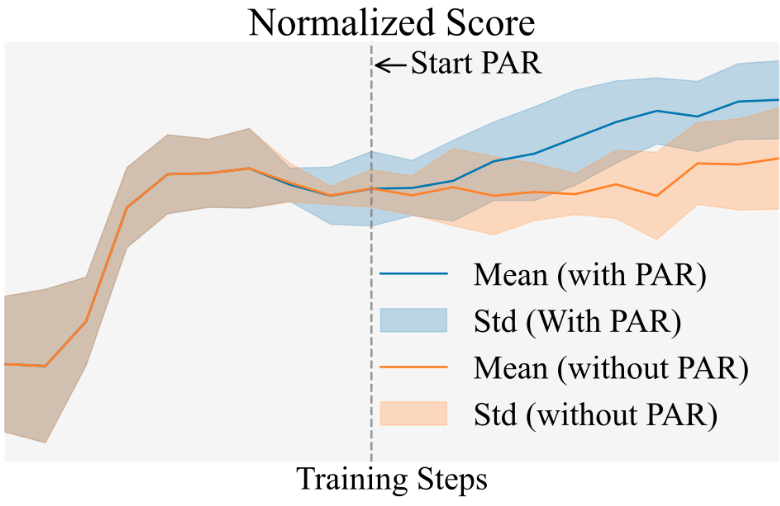
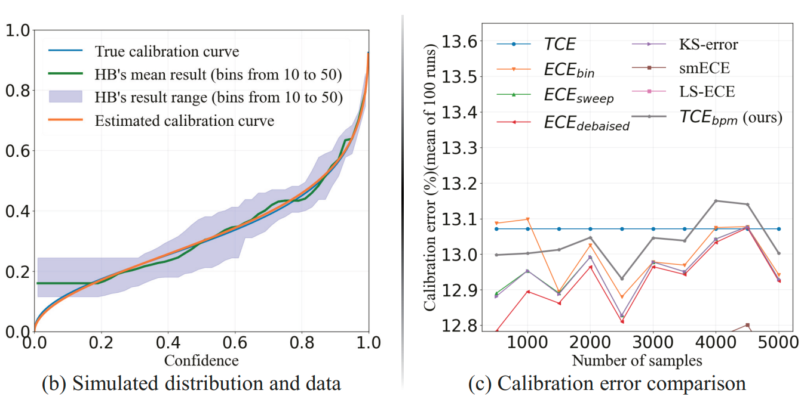
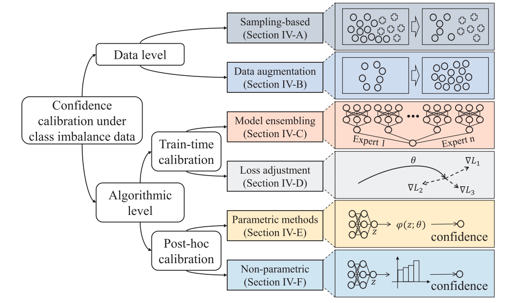
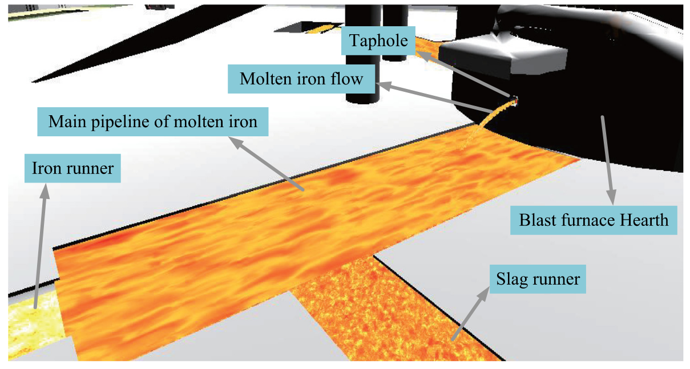
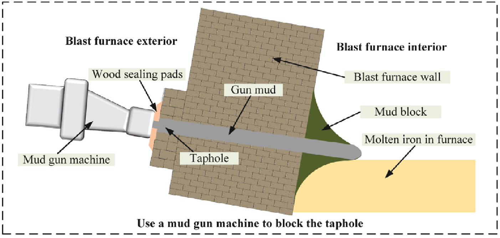

Hi there 👋

- 🔭 I’m currently a PHD focusing on **Deep Learning; Confidence Calibration; Offline Reinforcement Learning; Generative Model**.
- 👯 I’m looking to discuss **Machine Learning; Confidence Calibration; Offline Reinforcement Learning; Flow Matching; Learning Theory; Conformal Prediction**.
- 😄 I'm doing a research internship at **Shanghai Ai Lab**.
- 📫 How to reach me: Please mail me at e1710947@u.nus.edu

  

<!--
**NeuroDong/NeuroDong** is a ✨ _special_ ✨ repository because its `README.md` (this file) appears on your GitHub profile.

Here are some ideas to get you started:

- 🔭 I’m currently working on ...
- 🌱 I’m currently learning ...
- 👯 I’m looking to collaborate on ...
- 🤔 I’m looking for help with ...
- 💬 Ask me about ...
- 📫 How to reach me: ...
- 😄 Pronouns: ...
- ⚡ Fun fact: ...

  

-->

# 📋 Project list

### 🛠️ Useful Tools

<table style="border: none; width: 100%; table-layout: fixed;"><colgroup><col width="320"/><col/></colgroup><tr>
<td width="320" valign="top" style="border: none; width: 320px; min-width: 320px;"></td>
<td valign="top" style="border: none; padding-left: 1em; word-wrap: break-word; overflow-wrap: break-word;">

### [Ai-Review](https://github.com/NeuroDong/Ai-Review) 

LLM-based Paper Review and Optimization Tool.  
Get **strengths, weaknesses, and suggestions** from a reviewer’s perspective.  

&emsp;• <strong>Online Website</strong>: <a href="https://ai-review.neurodong.top">ai-review.neurodong.top</a>  

&emsp;• <strong>Skills</strong>: Review .tex, .pdf, or .docx files locally in Cursor.

</td></tr></table>

<table style="border: none; width: 100%; table-layout: fixed;"><colgroup><col width="320"/><col/></colgroup><tr>
<td width="320" valign="top" style="border: none; width: 320px; min-width: 320px;"></td>
<td valign="top" style="border: none; padding-left: 1em; word-wrap: break-word; overflow-wrap: break-word;">
<h3 style="margin: 0 0 0.5em 0;"><a href="https://github.com/NeuroDong/Latex_for_review_comments">Latex for Review Comments</a> </h3>

LaTeX template for responding to reviewers' comments. Supports colored response blocks, summary comments, references, single/double-blind author info, figures/tables in change boxes.

&emsp;• <strong>Repo</strong>: <a href="https://github.com/NeuroDong/Latex_for_review_comments">GitHub</a>

</td></tr></table>

### 🔬 Research Project

<table style="border: none; width: 100%; table-layout: fixed;"><colgroup><col width="320"/><col/></colgroup><tr>
<td width="320" valign="top" style="border: none; width: 320px; min-width: 320px;"></td>
<td valign="top" style="border: none; padding-left: 1em; word-wrap: break-word; overflow-wrap: break-word;">
<h3 style="margin: 0 0 0.5em 0;"><a href="https://github.com/NeuroDong/OfflineRL-PAR">OfflineRL-PAR</a></h3>

Proximal Action Replacement (PAR) for Behavior Cloning Actor-Critic in Offline RL. 

A plug-and-play data replacer that replaces low-value actions with high-value actions to improve the performance of offline RL.

&emsp;• <strong>Paper</strong>: <a href="https://arxiv.org/abs/2602.07441">arXiv:2602.07441</a>

&emsp;• <strong>Code</strong>: <a href="https://github.com/NeuroDong/OfflineRL-PAR">GitHub</a>

</td></tr></table>

<table style="border: none; width: 100%; table-layout: fixed;"><colgroup><col width="320"/><col/></colgroup><tr>
<td width="320" valign="top" style="border: none; width: 320px; min-width: 320px;"></td>
<td valign="top" style="border: none; padding-left: 1em; word-wrap: break-word; overflow-wrap: break-word;">
<h3 style="margin: 0 0 0.5em 0;"><a href="https://github.com/NeuroDong/TCEbpm">TCEbpm</a></h3>

Combining Priors with Experience: Confidence Calibration Based on Binomial Process Modeling. It makes the confidence cores of sample sparse regions more accurate.

&emsp;• <strong>Paper</strong>: <a href="https://ojs.aaai.org/index.php/AAAI/article/view/33792">AAAI 2025</a>

&emsp;• <strong>Code</strong>: <a href="https://github.com/NeuroDong/TCEbpm">GitHub</a>

</td></tr></table>

<table style="border: none; width: 100%; table-layout: fixed;"><colgroup><col width="320"/><col/></colgroup><tr>
<td width="320" valign="top" style="border: none; width: 320px; min-width: 320px;"></td>
<td valign="top" style="border: none; padding-left: 1em; word-wrap: break-word; overflow-wrap: break-word;">
<h3 style="margin: 0 0 0.5em 0;"><a href="https://github.com/NeuroDong/Cali_for_imblance">Confidence Calibration for Class Imbalance</a></h3>

Confidence Calibration of Deep Learning-Based Classification Models Under Class Imbalance Data. It helps readers quickly understand the research states and future development directions of confidence calibration under class imbalance.

&emsp;• <strong>Paper</strong>: <a href="https://ieeexplore.ieee.org/abstract/document/11038829">TNNLS</a>

&emsp;• <strong>Code</strong>: <a href="https://github.com/NeuroDong/Cali_for_imblance">GitHub</a>

</td></tr></table>

<table style="border: none; width: 100%; table-layout: fixed;"><colgroup><col width="320"/><col/></colgroup><tr>
<td width="320" valign="top" style="border: none; width: 320px; min-width: 320px;"></td>
<td valign="top" style="border: none; padding-left: 1em; word-wrap: break-word; overflow-wrap: break-word;">
<h3 style="margin: 0 0 0.5em 0;"><a href="https://www.sciencedirect.com/science/article/abs/pii/S0952197623000337">Two-stage Classification for Taphole Monitoring</a></h3>

Novel monitoring method based on two-stage classification: rough classification (SE-ResNeXt) and fine classification (SENeXt-Decoder) with molten iron flow images and blast furnace operating state data.

&emsp;• <strong>Paper</strong>: <a href="https://www.sciencedirect.com/science/article/abs/pii/S0952197623000337">Engineering Applications of Artificial Intelligence (EAAI)</a>

</td></tr></table>

<table style="border: none; width: 100%; table-layout: fixed;"><colgroup><col width="320"/><col/></colgroup><tr>
<td width="320" valign="top" style="border: none; width: 320px; min-width: 320px;"></td>
<td valign="top" style="border: none; padding-left: 1em; word-wrap: break-word; overflow-wrap: break-word;">
<h3 style="margin: 0 0 0.5em 0;"><a href="https://www.sciencedirect.com/science/article/abs/pii/S0263224122013513">Using Molten Iron Flow Images to Help Block Taphole</a></h3>

A new monitoring method is proposed to realize the intelligent monitoring of the taphole blocking time in ironmaking process. According to the tapping stages, a categorical correction model and a remaining blocking time calculation model are constructed to obtain the accurate taphole blocking time.

&emsp;• <strong>Paper</strong>: <a href="https://www.sciencedirect.com/science/article/abs/pii/S0263224122013513">Measurement</a>

</td></tr></table>
